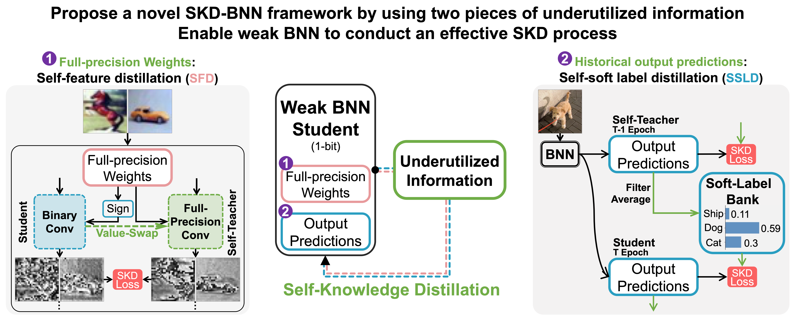

# SKD-BNN

This project is the PyTorch implementation of our paper : Self-Knowledge Distillation enhanced Binary Neural Networks using Underutilized Information.

**Dependencies:**

- Ubuntu == 18.04
- GPU == NVIDIA V100
- GPU Driver == 460.106.00
- CUDA == 11.2.2
- cuDNN == 8.2.1
- Python == 3.8
- Pytorch == 1.9.1
- Torchvision == 0.10.0

**Accuracy:** 
MNIST:
|   Model   | Bit-Width (W/A) | Top-1 Acc. (%) |
| --------- | --------------- | ------------ |
|   3-MLP   | 1 / 1           | 98.78        |

CIFAR-10:
|   Model   | Bit-Width (W/A) | Top-1 Acc. (%) |
| --------- | --------------- | ------------ |
| VGG-Small | 1 / 1           | 91.4         |
| ResNet-20 | 1 / 1           | 87.2         |
| ResNet-18 | 1 / 1           | 93.0         | 

ImageNet:
|   Model   | Bit-Width (W/A) | Top-1 Acc. (%) |
| --------- | --------------- | ------------ |
| ResNet-18 | 1 / 1           | 59.7         |

<!-- ## Citation

If you find our code useful for your research, please consider citing:

    @article{XXXXXX,
      title={Self-Knowledge Distillation enhanced Binary Neural Networks using Underutilized Information},
      DOI={XXXXXX},
      author={XXXXXX},
      journal={XXXXXX},
      year={XXXXXX},
      month={XXXXXX}
    } -->

## Wzixin

                                                                                        
                       ,--.                                           ,--.         ,--. 
      .--.--.      ,--/  /|    ,---,                  ,---,.        ,--.'|       ,--.'| 
     /  /    '. ,---,': / '  .'  .' `\              ,'  .'  \   ,--,:  : |   ,--,:  : | 
    |  :  /`. / :   : '/ / ,---.'     \     ,---,.,---.' .' |,`--.'`|  ' :,`--.'`|  ' : 
    ;  |  |--`  |   '   ,  |   |  .`\  |  ,'  .' ||   |  |: ||   :  :  | ||   :  :  | | 
    |  :  ;_    '   |  /   :   : |  '  |,---.'   ,:   :  :  /:   |   \ | ::   |   \ | : 
     \  \    `. |   ;  ;   |   ' '  ;  :|   |    |:   |    ; |   : '  '; ||   : '  '; | 
      `----.   \:   '   \  '   | ;  .  |:   :  .' |   :     \'   ' ;.    ;'   ' ;.    ; 
      __ \  \  ||   |    ' |   | :  |  ':   |.'   |   |   . ||   | | \   ||   | | \   | 
     /  /`--'  /'   : |.  \'   : | /  ; `---'     '   :  '; |'   : |  ; .''   : |  ; .' 
    '--'.     / |   | '_\.'|   | '` ,/            |   |  | ; |   | '`--'  |   | '`--'   
      `--'---'  '   : |    ;   :  .'              |   :   /  '   : |      '   : |       
                ;   |,'    |   ,.'                |   | ,'   ;   |.'      ;   |.'       
                '---'      '---'                  `----'     '---'        '---'         
                                                                                        
                                                                                       
